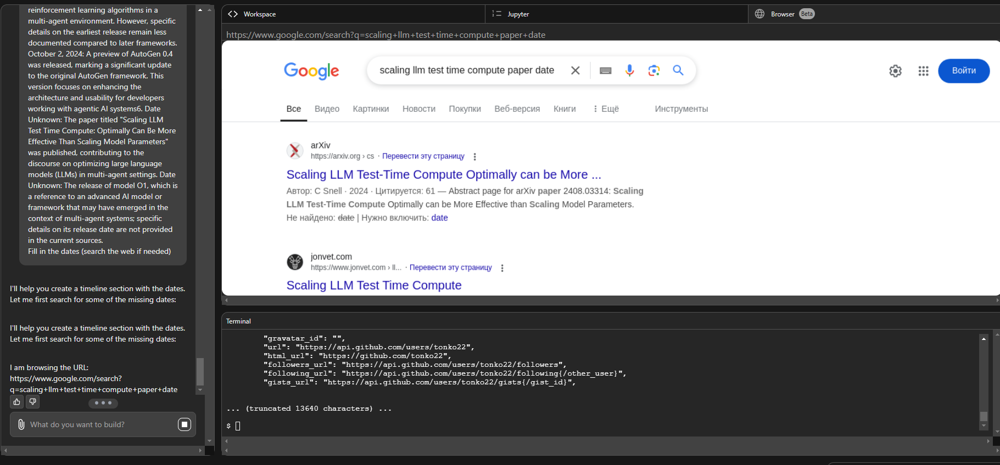

# Содержание

- [Коротко в историю](#коротко-в-историю)
- [Хронология развития мультиагентного подхода](#хронология-развития-мультиагентного-подхода)
- [Глоссарий](#глоссарий)

# Коротко в историю

<details open>
<summary>Как развивался GenAI</summary>


</details>

<details open>
<summary>Цикл зрелости технологий Gartner для AI/ML</summary>


</details>

<details open>
<summary>Радар влияния технологий Gartner</summary>


</details>

<details open>
<summary>Весна в AI</summary>


Кусочек таймлайна картинкой из [презентации СПбГУ](https://logic.pdmi.ras.ru/~sergey/teaching/mlspsu2023.html). 
Мультиагентный подход в R'n'D, но не как основное направление.
Параллельно развивается reasoning-подходы, не обязательно реализованные с помощью агентных-фреймворков.
</details>

# Хронология развития мультиагентного подхода

- **20 марта 2023**: Опубликована статья ["Reflexion: Language Agents with Verbal Reinforcement Learning"](#reflexion-language-agents-with-verbal-reinforcement-learning), представляющая подход к промптированию, повышающий точность решения сложных задач, основанный самокритике. Реализован через контекст и несколько "агентов"

- **7 декабря 2023**: Опубликована статья ["Practices for Governing Agentic AI Systems"](#practices-for-governing-agentic-ai-systems), устанавливающая базовые принципы для безопасного внедрения AI-агентов.

--- **2024** ---


- **25 января 2024**: Опубликована статья "Agent AI: Surveying the Horizons of Multimodal Interaction", исследующая перспективы мультимодальных агентных систем. Основные тезисы:
  - Определение "Agent AI" как класса интерактивных систем, способных воспринимать визуальные стимулы, языковые входные данные и другую контекстную информацию
  - Акцент на улучшение агентов через предсказание следующих действий с учетом внешних знаний и мультисенсорных входных данных
  - Внедрение агентов в реальную среду помогает уменьшить галлюцинации больших языковых моделей
  - Перспектива создания виртуальных сред для взаимодействия с воплощенными агентами

  <details>
  <summary>Общая схема Agent AI системы</summary>

  

  Схема демонстрирует обзор системы Agent AI, способной воспринимать и действовать в различных доменах и приложениях. Agent AI рассматривается как перспективный путь к Искусственному Общему Интеллекту (AGI). Обучение агентов показало способность к мультимодальному пониманию физического мира. Система предоставляет фреймворк для реальность-агностического обучения, используя генеративный AI вместе с множеством независимых источников данных. Большие фундаментальные модели, обученные для агентных задач, могут применяться как в физическом, так и в виртуальном мирах благодаря обучению на кросс-реальностных данных.
  </details>

- **7 августа 2024**: Опубликована статья ["Scaling LLM Test Time Compute: Optimally Can Be More Effective Than Scaling Model Parameters"](#scaling-llm-test-time-compute-optimally-can-be-more-effective-than-scaling-model-parameters), исследующая эффективность переноса ресурсов на этап инференса. Проверяется гипотеза о том, что более маленькие модели могут также эффективно решать сложные задачи за счет автоматической декомпозиции задач и агрегации результатов подшагов задачи.

- **12 сентября 2024**: OpenAI выпустила O1-preview и O1-mini - новую серию AI-моделей, разработанных для более глубокого анализа перед ответом с помощью reasoning-подхода
Подробнее в [статье "Scaling test time compute..."](#scaling-llm-test-time-compute-optimally-can-be-more-effective-than-scaling-model-parameters).

  <details>
  <summary>Прирост точности в решении сложных математических задач за счет Test Time Compute Scaling</summary>

  

  </details>

- **7 ноября 2024**: Опубликована статья ["Magentic-One: A Generalist Multi-Agent System for Solving Complex Tasks"](#magentic-one-a-generalist-multi-agent-system-for-solving-complex-tasks), представляющая новый подход к мультиагентным системам с улучшенным планированием и восстановлением после ошибок.

  <details>
  <summary>Видение Amazon облачной архитектуры агентов</summary>

  
  </details>

## Хронология выхода фреймворков

- **Октябрь 2022**: Выпущен **LangChain (+langgraph)** - открытый фреймворк для разработки приложений на основе LLM, предоставляющий модульную среду для создания LLM-приложений, таких как чатботы и виртуальные агенты.

- **Сентябрь 2023**: Microsoft выпускает **AutoGen** - открытый фреймворк для создания мультиагентных систем на основе LLM, позволяющий агентам взаимодействовать друг с другом, людьми и различными инструментами скоординированным образом.

- **Ноябрь 2023**: Amazon представляет **AWS Multi-Agent Orchestrator** - решение для управления множеством AI-агентов, маршрутизации запросов, поддержания контекста и интеграции с различными средами. Поддерживает реализацию на Python и TypeScript.

  <details>
  <summary>Архитектура AWS агентов</summary>

  
  
  Видение Amazon архитектуры облачных агентов.

  </details>

- **10 марта 2024**: Первый коммит OpenHands - открытой платформы для разработки программного обеспечения с помощью AI-агентов. Платформа позволяет агентам выполнять любые действия, доступные человеку-разработчику.

- **Май 2024**: Релиз **GigaGraph** - библиотеки для работы с LLM, позволяющей создавать приложения с множеством взаимодействующих цепочек (акторов) и поддержанием состояния данных (DEPRECATED: слилась с langgraph).

- **26 июня 2024**: Анонсирован **Llama Agents** - асинхронный фреймворк для создания, итерации и развертывания мультиагентных AI-систем, где каждый агент работает как отдельный сервис.

- **2 октября 2024**: Выпущен предварительный релиз AutoGen 0.4, значительное обновление оригинального фреймворка AutoGen. Версия фокусируется на улучшении архитектуры и удобства использования для разработчиков агентных AI-систем.

- **15 октября 2024**: Выпущен **Swarm** - фреймворк, акцентирующий внимание на легкой координации между агентами, используя рутины и передачу управления для облегчения совместной работы в сложных рабочих процессах.

- **Октябрь 2024**: Представлен **CrewAI** - фреймворк, позволяющий создавать AI-команды, где каждый агент имеет определенные роли, инструменты и цели, работая вместе для выполнения сложных задач.

  <details>
  <summary>Пример сериализации агентов</summary>

  ```yaml
  developer:
  role: >
    Senior Python Developer
  goal: >
    Read and understand the task: {task},
    Analyze task requirements, implement a clean, efficient Python solution,
    and ensure it is properly saved to code.py using the FileWriterTool.
  backstory: >
    You're a senior Python developer who excels at writing clean, maintainable code
    and ensuring proper file management. You understand the importance of saving work
    correctly and always use the FileWriterTool to save your implementations.
  llm: anthropic/claude-3-5-sonnet-20240620

  tester:
    role: >
      Code Testing Specialist
    goal: >
      Execute code.py in a sandbox environment using CodeInterpreterTool with the file path,
      capture execution outputs, and create a clear summary in report.md.
    backstory: >
      You're a code testing specialist who focuses on safe code execution
      and clear reporting. You execute Python files in controlled environments using
      the CodeInterpreterTool and produce concise, informative execution reports.
    llm: anthropic/claude-3-5-sonnet-20240620
    ```
  </details>
  >
  <details>
  <summary>Пример сериализации шаблона задачи</summary>

  ```yaml
  implementation_task:
  description: >
    Implement a Python solution for the given task:
    {task}
    and save it to code.py.
    
    Requirements:
    - Follow Python best practices and PEP8
    - Include proper input validation
    - Add docstrings and comments
    - Use FileWriterTool to save the implementation to code.py
    - Ensure the file is properly saved before completion
  expected_output: >
    A well-documented Python implementation properly saved to code.py using FileWriterTool
  agent: developer

  reporting_task:
    description: >
      Execute code.py in a sandbox environment and create an execution report:
      
      Steps:
      1. Execute code.py using CodeInterpreterTool with the file path
      2. Capture all execution outputs
      3. Create a clear summary of the execution results
      4. Save both outputs and summary to report.md

      Note: The CodeInterpreterTool now accepts a file path instead of code string.
      Make sure to provide the full path to code.py when executing.
    expected_output: >
      A report.md file containing execution outputs and a clear summary
    agent: tester
  ```
  </details>

  <details>
  <summary>Пример работы CrewAI Docs Agent</summary>

  
  *CrewAI Docs Agent анализирует запрос пользователя и ищет релевантную информацию в базе знаний*

    
    *На основе найденной информации агент генерирует структурированный ответ с примерами использования*
  </details>

- **Декабрь 2024**: Релиз **Emergence AI Orchestrator** - системы, разработанной для управления и координации множества автономных агентов в реальном времени, обеспечивая сложные рабочие процессы и взаимодействия.

## Статьи


## Reflexion: Language Agents with Verbal Reinforcement Learning

**Authors**: Noah Shinn, Federico Cassano, Edward Berman, Ashwin Gopinath, Karthik Narasimhan, Shunyu Yao

**Link**: [Paper](papers/reflexion-language-agents-with-verbal-reinforcement-learning.pdf)

**Paper origin date**: 2023-03-20

### Summary

Идея: Создание фреймворка для обучения языковых агентов через вербальную обратную связь без необходимости обновления весов модели. Агенты учатся на своих ошибках, анализируя результаты и сохраняя рефлексию в памяти.

- **Как это работает**:
  - Агент выполняет задачу и получает обратную связь (числовую или текстовую)
  - Проводит вербальную рефлексию над полученной обратной связью
  - Сохраняет результаты рефлексии в буфере эпизодической памяти
  - Использует накопленный опыт для улучшения решений в последующих попытках
  - Может работать как с внешней, так и с внутринней (симулированной) обратной связью

- **Ключевые находки**:
  - Метод значительно улучшает результаты базового агента на различных задачах
  - Достигнута точность 91% на бенчмарке HumanEval (программирование), превосходя GPT-4 (80%)
  - Подход гибок и может использовать разные типы обратной связи
  - Не требует дорогостоящей переподготовки модели

- **Практические выводы**:
  - Вербальная рефлексия - эффективный способ обучения языковых моделей
  - Важно правильно структурировать и хранить опыт предыдущих попыток
  - Метод особенно эффективен для задач программирования и последовательного принятия решений
  - Подход можно комбинировать с другими методами обучения агентов


<details>
<summary>Диаграмма рефлексии</summary>


</details>

### Scaling LLM Test-Time Compute Optimally Can Be More Effective Than Scaling Model Parameters

**Authors**: Tianle Cai, Yuhao Wang, Zhengyang Geng, Jason D. Lee

**Link**: [Paper](papers/scaling-llm-test-time-compute-optimally-can-be-more-effective-than-scaling-model-parameters.pdf)

**Paper origin date**: 2024-08-07

### Summary

Идея: Можно улучшить производительность LLM на сложных задачах без увеличения размера модели за счет правильного управления вычислительными ресурсами во время инференса модели. 

- **Как это работает**:
  - Предсказываем количество подшагов, требуемых для решения задачи. Для этого используем отдельно обученую scoring-модель. 
  - Просим LLM декомпозировать задачу на соответствующее количество подшагов с помощью prompt-шаблона.
  - Решаем подшаги последовательными вызовами LLM, сверяясь с планом на каждом шагу.
  - Объединяем результаты подшагов в финальный ответ.
  - Опционально: Решаем задачу оптимизированного поиска по графу подшагов с помощью beam-search.

- **Ключевые находки**:
  - Маленькая модель с оптимизированным инференсом может показывать результаты на уровне больших моделей
  - Авторы разработали подход для декомпозиции задачи на подзадачи и определения оптимального момента остановки генерации
  - На практике это позволяет экономить до 40-50% вычислительных ресурсов без потери качества

- **Практические выводы**:
  - Не всегда нужно гнаться за увеличением количества параметров модели - часто можно получить тот же результат оптимизируя инференс
  - Важно правильно балансировать между длиной генерации и качеством результата
  - Для разных задач оптимальная стратегия может отличаться

<details>
<summary>Методы поиска по графу подшагов</summary>


</details>

<details>
<summary>Схемы взаимодействия агентов с контекстом</summary>


</details>


## Practices for Governing Agentic AI Systems

**Authors**: Yonadav Shavit, Sandhini Agarwal, Miles Brundage, et al.

**Link**: [Paper](papers/practices-for-governing-agentic-ai-systems.pdf)

**Paper origin date**: 2023-12-07

### Summary

Идея: Создание базовых принципов и практик для безопасного внедрения агентных AI-систем в общество. Агентные системы - это AI-системы, способные преследовать сложные цели с ограниченным прямым контролем.

- **Как это работает**:
  - Определяются все участники жизненного цикла агентной системы
  - Для каждого участника формулируются базовые обязанности
  - Устанавливаются практики безопасности и контроля
  - Внедряются механизмы мониторинга и отчетности

- **Ключевые находки**:
  - Выделено 7 ключевых практик безопасности: оценка пригодности задачи, ограничение пространства действий, настройки поведения по умолчанию, прозрачность действий, автоматический мониторинг, атрибуция, возможность прерывания
  - Определены основные роли и ответственности в экосистеме агентных систем
  - Разработаны рекомендации по оценке и тестированию агентов

- **Практические выводы**:
  - Необходимо тщательно оценивать задачи перед передачей их агентным системам
  - Важно обеспечить многоуровневый контроль за действиями агентов
  - Следует уделять особое внимание редким ошибкам, которые могут накапливаться
  - Требуется баланс между автономностью агентов и безопасностью их работы

## Magentic-One: A Generalist Multi-Agent System for Solving Complex Tasks

**Authors**: Adam Fourney, Gagan Bansal, Hussein Mozannar, Cheng Tan, et al.

**Link**: [Paper](papers/magentic-one-a-generalist-multi-agent-system-for-solving-complex-tasks.html)

**Paper origin date**: 2024-11-07

### Summary

Идея: Создание универсальной мультиагентной системы, способной решать сложные задачи за счет эффективного планирования, многошагового рассуждения и восстановления после ошибок.

- **Как это работает**:
  - Главный агент "Orchestrator" управляет процессом:
    - Создает и отслеживает план выполнения
    - Перепланирует при возникновении ошибок
    - Координирует специализированных агентов
  - Специализированные агенты выполняют конкретные задачи (веб-браузинг, работа с файлами, программирование)
  - При ошибках система автоматически адаптирует стратегию

- **Ключевые находки**:
  - Модульная архитектура позволяет легко добавлять и удалять агентов
  - Не требуется дополнительная настройка промптов при изменении команды агентов
  - Система показывает результаты на уровне state-of-the-art на нескольких бенчмарках
  - Подтверждена эффективность мультиагентного подхода для универсальных систем

- **Практические выводы**:
  - Мультиагентный подход эффективнее одиночных агентов для сложных задач
  - Важно обеспечить правильную координацию между агентами
  - Модульность и гибкость архитектуры упрощают развитие системы
  - Открытый исходный код позволяет использовать наработки в других проектах

<details>
<summary>Схемы взаимодействия агентов magentic с контекстом</summary>


</details>


## Взаимодействие с мультиагентным фреймворком на примере OpenHands

OpenHands - это открытая платформа для разработки программного обеспечения с помощью AI-агентов. Платформа построена на основе нескольких ключевых open-source проектов и предоставляет агентам возможности, аналогичные человеку-разработчику.

### Архитектура и компоненты

<details>
<summary>Общая архитектура системы</summary>


</details>

<details>
<summary>Сессии и взаимодействие с браузером</summary>



</details>

<details>
<summary>Процесс обновления</summary>


</details>

### Основные компоненты

- **SWE Agent**: Адаптированный агент для программной инженерии из проекта princeton-nlp/swe-agent
- **Aider**: Интегрированный модуль для парного программирования с AI из проекта paul-gauthier/aider
- **BrowserGym**: Адаптированная система для работы с веб-браузером из проекта ServiceNow/BrowserGym


## И на примере Windsurf

Windsurf представляет собой инновационную интегрированную среду разработки (IDE), построенную на агентном подходе. Процесс разработки в Windsurf построен на постоянном взаимодействии между разработчиком и AI-агентом. Агент может анализировать код, предлагать изменения, создавать новые файлы и выполнять рефакторинг, основываясь на контексте проекта и требованиях пользователя.
Набор инструментов, доступных агенту в Windsurf, включает возможности для работы с файловой системой, поиска по коду, анализа зависимостей, запуска команд и модификации кодовой базы. Все инструменты интегрированы в единый интерфейс, что позволяет агенту эффективно решать сложные задачи разработки.

<details>
<summary>Изначальный промпт</summary>


</details>

<details>
<summary>Логгирование промежуточных шагов</summary>


</details>

<details>
<summary>Исправление цепочки пользователем</summary>


</details>

<details>
<summary>Результат исправления</summary>


</details>

<details>
<summary>Состояние сессии</summary>


Интерфейс взаимодействия пользователя с агентом в Windsurf построен на принципах естественного диалога, находясь при этом в отдельной сессии.
</details>

# Глоссарий

- **AGI (Artificial General Intelligence)** - Искусственный общий интеллект, гипотетическая форма ИИ, способная понимать, учиться и применять знания подобно человеку.

- **GenAI (Generative AI)** - Генеративный ИИ, способный создавать новый контент на основе обучающих данных.

- **Language Agent** - Языковой агент, автономная система на основе языковой модели, способная взаимодействовать с окружением и принимать решения.

- **LLM (Large Language Model)** - Большая языковая модель, нейронная сеть, обученная на огромных объемах текстовых данных.

- **Multimodal Interaction** - Мультимодальное взаимодействие, способность системы работать с различными типами данных (текст, изображения, звук).

- **Prompt Engineering** - Искусство составления эффективных запросов к языковым моделям для получения желаемых результатов.

- **Reasoning** - Рассуждение, способность системы логически обрабатывать информацию и делать выводы.

- **Reinforcement Learning** - Обучение с подкреплением, метод машинного обучения, основанный на получении вознаграждения за правильные действия.

- **State-of-the-art** - Современный уровень развития технологии, лучшие достижения в определённой области.

- **Verbal Reinforcement** - Вербальное подкрепление, метод обучения агентов через текстовую обратную связь.